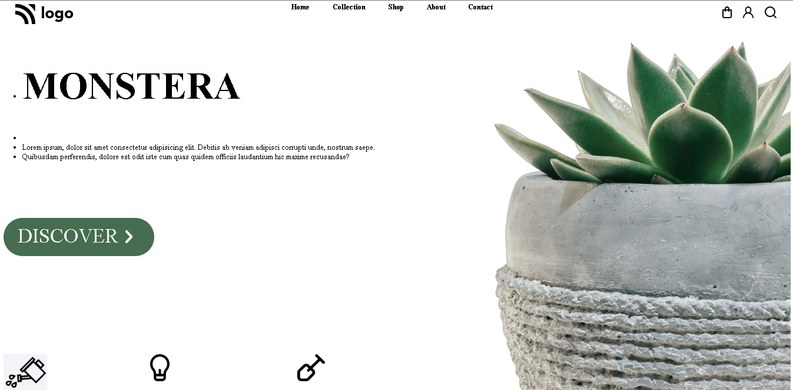

# Assignment-6

# Project [Deployed Link](https://deepakproject06.netlify.app)

- What I learned from this Project?
  - 
  - How to create navbar and align items using flex.
  - CSS hover pseudo-class and box-shadow property.
  
  - How to acess direct child.
  - How to use different Google Fonts in webpage.
  

 
---

## Time taken to finish this project

- 3.5 hour to complete it.

---

## ScreenShot

